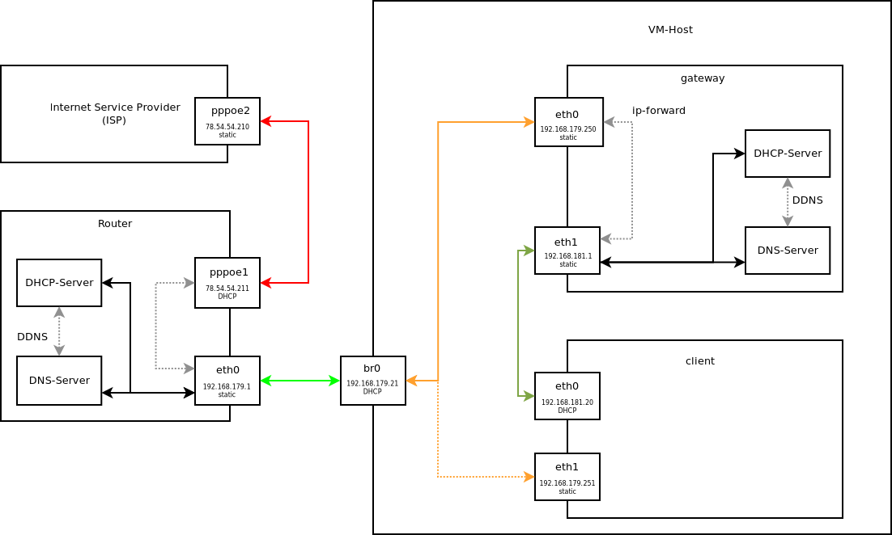

# linux_ws2122 - Ansible

Setup gateway and client vm via Ansible. A DHCP and DNS server is installed on
the gateway VM. Issued DHCP leases are transmitted via DDNS as forward and
reverse entry of the zone `linuxws2122.de`.

## Requirements

Requirements or individual adaptations to be able to run the Ansible Playbook:

- Two Fedora 34 VMs are needed (gateway and client). Both receive a network
  interface, which are connected to the subnet of the domestic router via the
  network bridge `br0` of the host system in order to receive an IP address of the
  router. This connection is shown in the network diagram with the colour `orange`.

  In addition, both VMs receive a second network interface for internal
  communication. The connection is shown in the network diagram in the colour
  grey.

- Adapt IP-Addresses of the client and gateway VM in `host_vars`, if the
  IP-Addresses are not equal with the pre-defined ones.
- Adapt name of the interfaces for booth VMs in `host_vars`, if the names of the
  interface are not equal with the pre-defined ones.
- Configure your Router (Fritz!Box, SpeedPort, ect) to route traffic for
  `192.168.181.0/24` via `gateway`.
- Enable password root login with SSH. Set password in `group_vars/all/ansible.yaml`.
- Restart VMs after running the playbook.

## Running the Playbooks

```bash
ansible-playbook -i hosts.yaml gateway.linuxws2122.de.yaml
ansible-playbook -i hosts.yaml client.linuxws2122.de.yaml
```

## Network diagram


